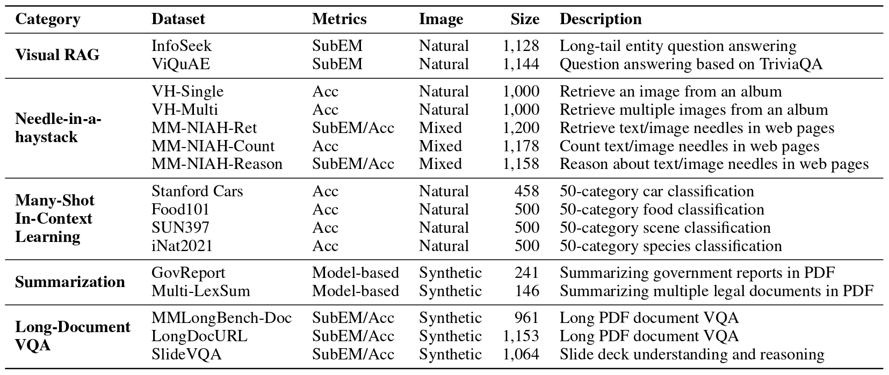

# MMLongBench: Benchmarking Long-Context Vision-Language Models Effectively and Thoroughly

---

Our arXiv paper will be available online soon. Thank you for your patience.
<p align="center">
<a href="https://huggingface.co/datasets/ZhaoweiWang/MMLongBench/blob/main/README.md" target="_blank" rel="noopener noreferrer">
        
    </a>
    <a href="" target="_blank" rel="noopener noreferrer">
        
    </a>
</p>

MMLongBench is a comprehensive benchmark covering a diverse set of long-context vision-language tasks, to evaluate long-context vision-language models (LCVLMs) effectively and thoroughly. 
It is composed of 13,331 examples spanning five different categories of downstream tasks, including Visual RAG, NIAH, Many-Shot ICL, Summarization (based on PDF documents), and Long-Document VQA.
Please check out the paper for more details, and this repo will detail how to run the evaluation.

## Quick Links

- [Setup](#setup)
- [Data](#data)
- [Running evaluation](#running-evaluation)
- [Adding new models](#adding-new-models)
- [Adding new tasks](#adding-new-tasks)
- [Tips](#tips)
- [Contacts](#contacts)
- [Acknowledgment](#acknowledgment)


## Setup

Please install the necessary packages with (using a virtual environment with anaconda is recommended, tested with python 3.11):
```bash
pip install -r requirements.txt
```

Additionally, if you wish to use the API models, you will need to install the package corresponding to the API you wish to use
```bash
pip install openai # OpenAI API (GPT), we also used OpenAI SDK to run Anthropic API (Claude) 
pip install google-genai
```
You also need to set the correct environmental variables according to the official documentation of the API SDK
Please check ```vlm_model/gemini.py``` and ```vlm_model/openai_model.py``` for more details.

## Data

<div align="center">
    
    <br>
    <span>An overview of MMLongBench.</span>
</div>

Our benchmarks have two parts:
1. You can download the image data with the command:
```bash
bash scripts/download_image_data.sh
```
This will iteratively download the .tar.gz file of images for each task and then decompress it to the `mmlb_image` directory.

2. You can download the text data with this command:
```
wget -c https://huggingface.co/datasets/ZhaoweiWang/MMLongBench/resolve/main/mmlb_data.tar.gz
  tar -xzvf mmlb_data.tar.gz
```
This will decompress the mmlb_data.tar.gz into the `mmlb_data`. All the test files are stored in jsonl format.

Our dataset is hosted on this [HuggingFace Dataset](https://huggingface.co/datasets/ZhaoweiWang/MMLongBench)

### Using Image URL for API models
We find that when using API models, uploading images are very slow.
Thus, we upload uncompressed iamges to the Huggingface Dataset [image_collection](https://huggingface.co/datasets/ZhaoweiWang/image_collection).
For GPT-4o and Claude-3.7-Sonnet, our code can use URLs instead of Base64 image encoding.


## Running evaluation

To run the evaluation, just select one of the config files from the configs directory. You can override any settings from the config file or introduce new arguments directly via the command line (refer to arguments.py for details).

```bash
model_name=Qwen/Qwen2.5-VL-3B-Instruct
dir_name=$(echo $model_name | rev | cut -d'/' -f1 | rev)
for task in "vrag"; do
    python eval.py --config configs/${task}_all.yaml --model_name_or_path ${model_name} \
    --output_dir {your output directory}/{dir_name} \
    --test_file_root {your data directory}/mmlb_data \
    --image_file_root {your data directory}/mmlb_image \
    --num_workers 16 --test_length 8
done
```

For shorter tasks, such as 8K and 16K, usually a single GPU is enough. 
Thus, we provide the scripts ```scripts/eval_task_manager.py```, which can run multiple config files at the same time.
We list the commands to use it in ```scripts/run_eval.sh```.

This will output the results file under the output directory in two files: `.json` contains all the data point details while `.json.score` only contain the aggregated metrics.

If you tested new models, please email me the result files and I will add them to the spreadsheet!
See [Contacts](#contacts) for my email.

### LLM-based evaluation (GTP-4o metric)
The code of running LLM-based evaluation for summarization in ```scripts/eval_gpt4_summ.py```.
Its corresponding command to use it is in ```scripts/eval_gpt4_summ.sh```

## Adding new models
We comprehensively evaluated 46 models using HuggingFace. Meanwhile, all the models count image tokens by the number of 
14x14 patches, followed by a 2x2 pixel unshuffle, or similar methods 
(e.g., first tile the image with the 336x336 size, then use 14x14 patch size and 2x2 pixel unshuffle).
The pixel unshuffle is very important to compress visual tokens.

Check whether your model is easily accessible using HuggingFace Transformers and whether your model is token efficient.

To add a new model, add a new python scripts called ```vlm_model/{your model name}.py```.
Meanwhile, you need to change ```load_LLM(args)``` function in ```vlm_model/__init__.py``` to correctly load your model.

Furthermore, you model scripts should implement `format_chat` (constructing the chat format data with both image and text)
, `prepare_inputs` (use processor to tokenize text and preprocess image), and `generate` functions. 
Please refer to the existing classes for your reference, such as ```vlm_model/qwen2_vl.py```.


## Adding new tasks
To add a new task/dataset:
1. you need to add a new config that specify the fields, such as input_max_length, generation_length,
test_files, etc.
2. you just need to modify the `data.py` file. Following our current data loading functions, such as ```def load_vrag(args, path, max_test_samples=None):```, and also remember to revise ```def load_data(args, dataset, path=None):``` to ensure your function is used.
3. you need to add your metric for the new task in `utils.py`

## Tips

<details>

<summary>Check Missing Tasks</summary>
We provide a script to quick check which task is missing

```bash
python scripts/check_missing.py
```

</details>

<details>

<summary>Figure Drawing</summary>
We provide all the scripts for drawing the figures in our paper in folder ```figure_scripts```.
We can easily change them to meet your own requirements.
</details>

## Contacts

For any questions, please email `zwanggy@cse.ust.hk`.


## Citation
Our arXiv paper will be available online soon. Thank you for your patience.

The author list of the work is:
Zhaowei Wang, Wenhao Yu, Xiyu REN, Jipeng Zhang, Yu Zhao, Rohit Saxena, Liang Cheng, Ginny Wong, Simon See, Pasquale Minervini, Yangqiu Song, Mark Steedman

## Acknowledgment
The code is built based on [HELMET](https://github.com/princeton-nlp/HELMET/tree/main).
We revised a lot to evaluation LVLMs, including configs, arguments, eval.py, metrics, data loading.
The most difference is that since LVLMs have non-unified function API, we write a script for each model in ```vlm_model```

## Misuse for malicious purposes
This dataset is constructed to support the development of Long-Context Vision-Language Models. It is strictly forbidden to use this dataset for other usage with high risk, such as generating or disseminating false, misleading, or harmful content, or for activities involving privacy violation, fraud, discrimination, harassment, violence, pornography, or any illegal purposes. Users must not use this dataset to train, fine-tune, or deploy any models or applications that violate laws, regulations, or ethical standards. By using this dataset, you agree to bear all legal and ethical responsibilities resulting from any misuse.

